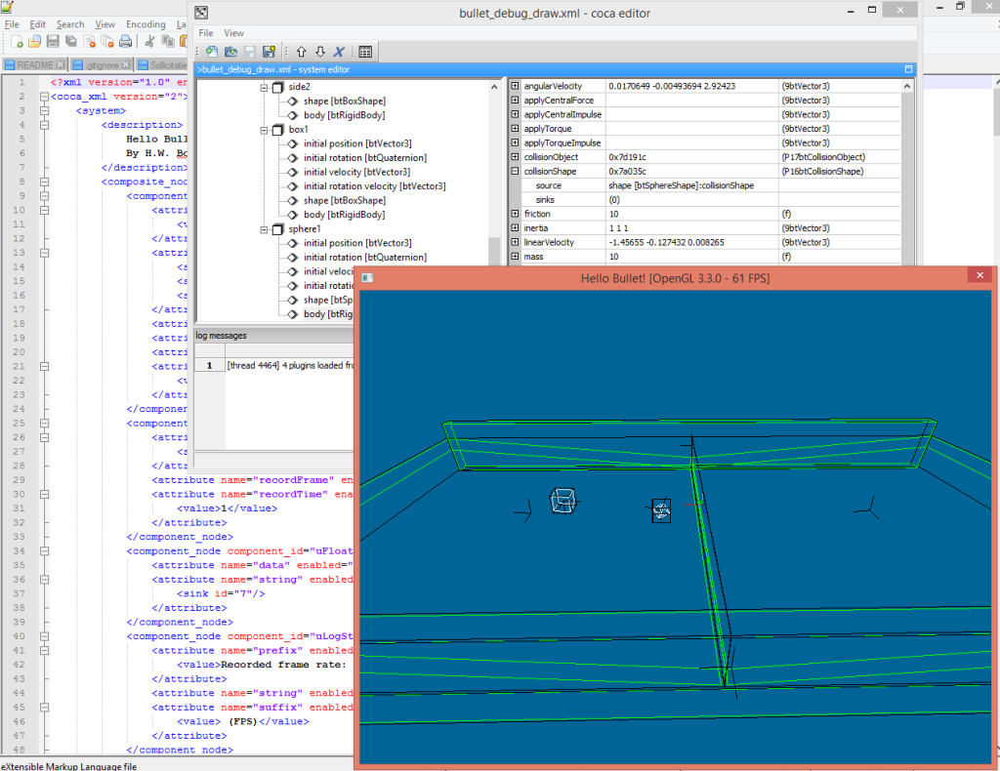

# Coca Project

The Coca framework allows you to create software components with input/output attributes. Attributes allow components to be linked together creating a system of components that can be run as a program. Components can be added to the framework using plugins.

The code is in alpha stage and was created in 2008-2009. It has some running XML examples and a simple editor that allows you to structure and connect the components and read/write the system from/to a file. 

## Samples

In the samples directory you can find a timer sample and a bullet-debug-draw sample. 

### timer sample

The timer sample is very simple. It has time delay constant connected to a timer, which is connected to a frame rate recorder. The frame rate recorder is connected to a logger which writes the frame rate to the log.

### physics and rendering sample

The bullet-debug-draw example uses the cocaBullet plugin for physics and the cocaIrrlicht plugin for graphics (see below). The sample has a small physics world with a box and a sphere that is rolling around. The world is rendered in window and you can use the mouse and arrow keys to move around. 

Below is a screenshot which shows the 3D world from the sample. In the background is the coca editor with the component tree on the left and component attributes editor on the right.

## Project

### coca

Coca is the core project which allows you to create systems, register components, add attributes to components and register system readers and writers. It also has some nice utility classes for logging, testing and more. If you want to create a new plugin of tool for the coca framework check out the template directory.

### cocaRunner

The runner is a simple tool that runs a coca system defined in a file. The samples use this tool to run.
 
### cocaEditor

This is a simple editor in which you can create, load or save coca systems. You can create a component tree and can edit and link component attributes. Load one of the samples in the editor to have a look. 

### cocaUtil

A plugin that adds utility components to the framework: A timer, a frame rate recorder, a logger, and several constant and conversion components.

### cocaXML

A plugin that adds XML reading and writing of coca systems to the framework.

### cocaBullet

A plugin that adds physics components to the framework using the [Bullet Physics Library](http://bulletphysics.org/). 

### cocaIrrlicht

A plugn that adds 3D redering components to the framework using the [Irrlicht 3D Engine](http://irrlicht.sourceforge.net/).

## License

Copyright 2008-2014 Harm Boschloo

Project licensed under the Apache License, Version 2.0 (the "License") except where mentioned otherwise. You may not use these files except in compliance with the License. You may obtain a copy of the License at

<http://www.apache.org/licenses/LICENSE-2.0>

Unless required by applicable law or agreed to in writing, software
distributed under the License is distributed on an "AS IS" BASIS,
WITHOUT WARRANTIES OR CONDITIONS OF ANY KIND, either express or implied.
See the License for the specific language governing permissions and
limitations under the License.